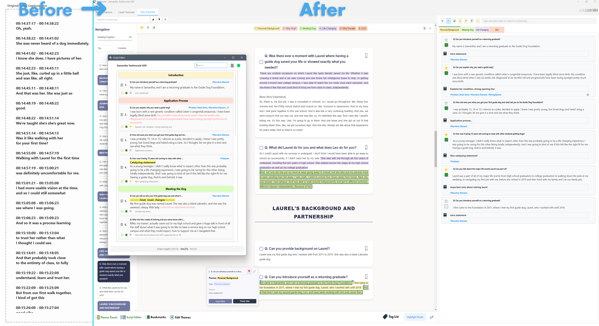

   

     
   

# Scriptoria: A Text-Based Video Editing Companion and General Purpose EReader with Theme-Centered Highlighting and Annotating, Gemini API integration

Scriptoria provides a text-based workflow for video editors to use AI to structure video captions into a structured and interactive text transcript. It is also a versatile tool for marking up and analyzing long-form documents like books and articles. Imported text gets automatically or manually formatted via a simple syntax system into a Scriptoria based format. Users then turn this into transcripts with custom themes/tags and highlight colors. Standout features include a Script Editor to create and arrange scripts, a robust tagging and filtering system, an interactive transcript with JS embedded functionality like tooltips that can be exported and delivered to clients as an HTML file, Adobe Premiere Pro drag and drop, Gemini API integration, and much more.

  

## The Main Problem It is Intended to Solve

For video editors working with interviews, documentaries, or event footage, the process of finding the right soundbites ("paper editing") can be slow and cumbersome. It often involves scrubbing through hours of footage or manually cross-referencing paper transcripts with timestamps. Video editors, like Adobe Premiere Pro are designed around video editing and as such the ability to structure narratives within the program is weighed down by a UI and UX that is designed to interact with video first and foremost. Not only that it is CPU and GPU intensive. Scriptoria circumvents that overhead and is designed to develop scripts and narrative in a more intuitive way.

Scriptoria streamlines this by allowing you to work with the transcript as the central element, giving you a bird's-eye view of your content and enabling you to build a story structure quickly and intuitively.

## How It Works: The Core Workflow

1.  **Process & Stylize Transcript:** Start with any text source. For video-editing, generate a caption text file in Adobe Premiere Pro (for example) and paste these captions into the Process Captions tab. Process it by using the program provided prompt in an LLM of your choosing or directly in software with the integrated **Gemini API** to automatically structure the captions into Scriptoria's accepted syntax formatting. You can also import text from **EPUBs** or from the internet, and Scriptoria will automatically format based on the embedded HTML or Markdown tags in the epub file or clipboard. Default prompts are provided, and a system is in place for you to write and store your own custom preset prompts.

2.  **Markup with Themes:** Instead of generic highlighting, you create custom **Themes** (e.g., "Emotional Moment," "Challenges," "Solutions"), each with a unique color and a keyboard hotkey (1-9, 0, -, +). As you read the transcript, select text and highlight segments by theme. You can also create tags, secondary themes, footnotes, set favorites, and mark segments as "used" if you've already used it in the video. A robust filtering system is designed to make it easy to find text according to these metadata categories.

3.  **Arrange in the Script Editor:** Every highlight you create becomes a movable block or **Annotation** in the **Theme Panel**. Here, you can drag and drop these blocks into the **Script Editor** to arrange your narrative. You can also **strikethrough** parts of text that you will cut out, mark segments as "used" by your edit, see estimated script length in minutes, and export the script as a PDF file to share.

4.  **Integrate with Premiere Pro:** Once your narrative is structured, **Alt+Drag** a text block from Scriptoria's Script Editor and drop it onto your Premiere Pro project window. This action simulates a search command, which locates and scrubs to in the timeline that exact text segment within your Premiere sequence, ready for you to splice into your timeline.

## A General-Purpose Tool for Text

While designed for video editors, Scriptoria's feature set makes it a capable tool for anyone working with long-form text:

*   **E-Reader & Study Tool:** Import EPUBs directly into the program. 
*   **Content Curation:** Organize research and articles by theme for easy reference.
*   **Qualitative Analysis:** Use the tagging and filtering system to analyze text-based data for patterns.

## Key Features

*   **🤖 AI-Powered Caption Processing:** Utilize the embedded Gemini API to transform raw, timecoded caption files into clean, readable text formatted with Scriptoria's syntax. The tool includes default prompts optimized for interviews, and allows you to **create, save, and manage your own custom prompts** for any project.
*   **🎨 Thematic Highlighting:** Create up to 12 distinct **Themes**, each with its own color and hotkey. Annotations can also be assigned **Secondary Themes** for more detailed categorization.
*   **🏷️ Robust Tagging System:** Add an unlimited number of searchable tags (e.g., `#Strong-Closing-Line`, `#key-moment`) to any highlight for precise organization.
*   **⚙️ Preset System:** Save and load custom sets of Themes and Tags to maintain consistency across projects.
*   **🌐 Interactive HTML Export:** Export your final, stylized transcript as a self-contained interactive HTML file. This export includes a functional navigation sidebar, search, and filtering, making it ideal for client reviews.
*   **🔍 Advanced Filtering:** Filter your entire transcript to show only relevant highlights. You can filter by one or more **Themes**, **Tags**, **Favorites**, or **Used/Unused** status.
*   **✨ Intelligent Highlighting Engine:** Scriptoria features a robust system for managing highlights. When you modify or remove a portion of a highlight, it intelligently creates new, distinct annotations for the remaining parts, preserving all associated metadata like notes and tags.
*   **🧠 Integrated AI Assistant:** Go deeper into your text. Highlight any passage in the transcript viewer and ask questions directly via an embedded Gemini API interface. Get quick summaries, explanations, historical context, or simplify complex language on the fly, without ever leaving the application.

## Who Is This For?

*   Video editors and documentary filmmakers.
*   General readers who are reading complex text
*   Students and academics

## Installation & Setup

**Windows:**
Download the latest release from the [Releases page](https://github.com/delisimedia/Scriptoria/releases) and run the installer.

**macOS:**
This application is currently built for Windows and a macOS version is not available.

## Dependencies

This project utilizes the following open-source libraries:

*   **PyQt6**: GUI toolkit. Licensed under GPLv3.
    *   [PyQt6 Website](https://www.riverbankcomputing.com/software/pyqt/intro)
    *   License: `LICENSES/GPLv3.txt`

*   **pyaudio**: Python bindings for PortAudio. Licensed under MIT License.
    *   [PyAudio PyPI](https://pypi.org/project/PyAudio/)
    *   License: `LICENSES/MIT.txt`

*   **BeautifulSoup4 (bs4)**: HTML/XML parser. Licensed under MIT License.
    *   [BeautifulSoup4 PyPI](https://pypi.org/project/beautifulsoup4/)
    *   License: `LICENSES/MIT.txt`

*   **google-generativeai**: Google Generative AI Python SDK. Licensed under Apache 2.0 License.
    *   [google-generativeai PyPI](https://pypi.org/project/google-generativeai/)
    *   License: `LICENSES/APACHE2.0.txt`

*   **PyMuPDF (fitz)**: PDF and XPS document toolkit. Licensed under AGPLv3.0.
    *   [PyMuPDF Website](https://pymupdf.readthedocs.io/en/latest/)
    *   License: `LICENSES/AGPLv3.txt`

*   **pdfminer.six**: PDF parser and analyzer. Licensed under MIT License.
    *   [pdfminer.six PyPI](https://pypi.org/project/pdfminer.six/)
    *   License: `LICENSES/MIT.txt`

---
**Note on Licenses:**
This project is open-source and uses libraries under various open-source licenses. Please refer to the `LICENSES` directory for the full text of each license.

Changelog history:

v.3.4.1
- Fixed dual clear and rebuild via renumber items on handle_removal_and_reassign in the script editor.
- dropEvent no longer clears and rebuilds in script editor.
- toggle_theme_view no longer requires update_theme_view
- Adding and removing headers are now optimized to not clear and rebuild.
- Fixed major bug where the improper handling of reassignment context flag was causing right-end reassignments to not emit updates in the script editor.
- New TagListDialog preset saving and loading functionality
- Two improvements and 1 opimization in context matching strategy in improve_strikethrough_display.
- Tab overflow is now handled with a custom horizontal scrollbar for better UX.
- On startup, update_theme_view is captured by the load progress dialog.
- Line breaks in annotations are properly carried over into the script editor.
- Tags are now moved to bottom left corner of widget.
- Speech-title truncation now expanded from 50 to 125 char.
- Fixed bugs with item label and widget sizing related to strikethroughs and headers in the script editor.
- Fixed a bug where tooltip expansion and pinning would no longer trigger.
- Fixed bug with filtering logic in theme view
- And other minor ui and ux improvements...
- Fixed bug with undo functionality 
- Fixed sticky headers getting stuck when loading between sessions
- Fixed bug where html exports got broken.
- Fixed bug where reordering items in gridview in taglistdialog were not updated visually to the user.
- Fixed bug where partial remove_highlight were not doing target updates on affected annotations
- Fixed bugs with drag and drop in TagListDialog, added drop indicators.
-Fixed bug where empty content placeholders in theme view were not triggering when removing the last annotation from the list.
- Tags in tooltip are hoverable and selectable for direct filtering. 
- Scrolling in the tooltip no longer triggers scrolling in the transcript.
- Sort Annotations Chronologically can now sort all tabs not just current tab.
- And several other BUGS fixed.

v3.4.0
Major Feautre: Can now add Secondary Themes to allow for one annotation to contain multiple themes. Primary Themes and Secondary Themes.
- NEW secondary_scenes and data-secondary-scenes attributes.
- NEW secondary scenes context menu option.
- Theme filtering in the DOM now accounts for secondary themes.
- Theme filtering system added to Theme View.
- Double click on tabs filter the relevant theme.
- Annotations in the the theme view now get new theme indicators on them to show secondary scenes.
- Fixed scroll to and select annotation in the web view functionality to now properly highlight with complementary colors.
- Fixed bugs in Edit Themes, where theme changes did not persist in sticky headers. 
- Tooltips now repereent and display theme colors.
- Tooltips now represent and display seconadary scenes.
- Edit Themes properly handles secondary scenes when changing themes. 
- Fixed bug where after edit themes, the renamed theme tabs were appended to the end instead of where they originally were.
- Fixed bug in remove_highlight that resulted in left and right spans not getting the dbclick event listener. 
-Fixed several edge case bugs that appeared when editing themes while filtering is active.
- Added UI + UX improvements to item widgets in the script editor and theme view for less visual clutter.
- Replaced unicode favorites star and used symbols with paintEvents.
- Several other minor UI and UX improvements...

v3.3.5
-NEW annotation indicators in the scroll bar during filetering in the web view.
- NEW navigate next and navigate previous annotation during filtering in the web view

v3.3.4
- Major performance optimization for update_theme_view - no longer clears all tabs and completely rebuilds! Is much faster!
- Adjusted various methods to be compatible with new update_theme_view logic.
- Improved mobile layout support for exported HTM.
- Fixed some bugs with exported HTML.
- Exporting HTML now immediately navigates to folder where file was saved.
- Added safeguards to save_session to prevent data corruption if user triggers a closeEvent while saving.
- Added hover dragenter overlay in the Script Editor.
- Drop indicators in the script editor now correctly show during external drags.
- Fixed some sync issues with Script Editor changes and theme view + DOM when active filters.
-Fixed bug where empty script editor placeholder text was not appearing.
-NEW batch multi-select annotation removal in the script editor.
- Fixed context menu not appearing on a script editor item widget when right clicking the drag handle. 
- Fixed custom drop indicator positioning bugs in Script Editor and Theme View.
- Fixed find annotation in theme view call from script editor failing to select annotation when it has to first toggle_theme_view.

V3.3.3
- Overhauled the sticky theme header to be properly built with JS and be injected straight into the web view.
- Sticky header now has its own settings menu and can be resized there.
- Sticky header can now be hidden and shown.
- NEW tag filtering JS dialog built into the DOM. 
- NEW favorites and used JS filtering built into the DOM sticky header.
- Options to refresh DOM filters and clear all DOM filters in a sticky header action menu.
- Critical fix: Removed unnecessary update_theme_view call during handle_removal_and_reassign that occured when the theme view wasn't open.
- Improved session load times.
- Fixed longstanding bug where bookmarks images were not loaded on startup and had to be fixed after session load.
- Fixed bug where tooltips were flashing in on session load. 
- Fixed bugs with double click and alt double click annotation sleection in the DOM not persisting for newly created annotations.
- Fixed bug where previous selections weren't clearing when creating annotations.
- Updated saved output HTML to have the changes made to tooltip functionality and to include sticky header _+ filtering.
- Fixed bug where save_session was saving the hidden states in the DOM caused by filtering.

V3.3.2
- NEW Filter Headers dialog to filter by scene_title. 
- TagListDialog completely overhauled for better UX. 
- Renaming and deleting tags in the TagListDialog now will properly update all instances of that tag that was renmaed and deleted across the DOM, the theme view and storyboard.
- When updating theme view, the UI is blocked to prevent user error.
- Fixed bugs with tags and speech-title layout issues in theme view and storyboard.
- Tags properly truncate and fill available widget space. 
- Removed qtimer reliance so that last scroll pos and tooltips trigger faster after session load.
- Updateitemsizes now runs in a separate thread to ensure ui doesnt freeze while running.
- Tags in storyboard are now in sync with tag updates in theme view.
- Double click selecting an annotation in the DOM will select the FULL annotation.
- Selection highlight is now transparent to show highlight span colors underneath.
- Context menu options in the DOM now for navigate to storyboard and navigate to theme view to find annotations.
- Speech-title represneted in tooltips of annotation.
- Improved ui and ux for tooltips. 
- Various other minor UI and UX improvements across theme view, tags, and more.

V3.3.1
- Removed update_theme_view reliance when adding an annotation while filtering/searching in the theme view.
- Call to populate_order_list is now truly synchronous during handle_removal_and_reassign.
- Fixed bugs with empty content placeholders and theme view updating when annotations are added while searching and filtering caused by the removal of update_theme_view call.
- Update_theme_view updated to properly handle new active filtering logic.
- Fixed bugs with toggle_theme_view placeholder not completing and getting stuck due to active filtering/searching.
- Removed redundant logic that triggered populate_order_list when removing non-storyboard annotations
- Added annotation selection logic to handle_removal_and_reassign
- Added annotation selection logic to handle_removed_spans
- Other minor UI and UX bug fixes within ThemeViewSearch
- Loading project dialog now opens modally and centered with the main window.

V3.3.0
- Favorites toggling, used status toggling, and notes updating in both theme view and storyboard context are in sync without leading to expensive update_theme_view and populate_order_list calls.
- Eliminated expensive update_theme_view call from handle_removal_and_reassign.
- Remove annotation from the storyboard no longer unnecessarily triggers expensive call to update_theme_view.
- Searching and filtering is no longer tied to expensive update_theme_view calls, and is now faster and more efficient.
- NEW tags are now a data attribute for an annotation, and better reflected in annotation widgets.
- NEW scene-title attribute in annotation data and on widgets.
- NEW Pin and Expand buttons added to tooltip as well as tags.
- Added new Filter tags button and dialog in ThemeViewSearch to improve UX around tag filtering and searching.
- Many UX improvements to the tagging process, with grid layouts, checkboxes, search boxes, improved custom functionality to smooth ux while tagging and filtering.
- Added alphabetical sort button to tags list.
- Progress overlay now only occurs during toggle_theme_view not during normal update_theme_view calls when theme view is visible.
- Newly added annotations now get visually selected in the theme view for better UX

V3.2.2
-Fixed bug with bookmark description corrupting HTML
  - Targeted annotation removal (no full theme view rebuilds on highlight removal)
  - Faster theme view updates (no tab switching during finalization)
  - Progress overlay added to update_theme_view.

V3.2.1
-Added Preset Prompt option to Scriptoria AI. You can now write and save a preset prompt that can be quickly applied.
-Scroll pos restored when favoriting an item in annotationlistwidget
- Changed gemini-2.5-flash-lite-preview-06-17 to germini-2.5-flash-lite

V3.2.0
-Added sticky headers to the transcript web view that show available themes. When themes are clicked, they can be toggled to hide and unhide the highlighted themes from the transcript. 
-Added changes_pending call to edit themes.
-Fixed critical bug that was created in renumber_items_without_strikethrough in previous updates.
-Critical bug fix in strikethrough handling

V3.1.7
-Added new pixmap drag and drop styling to AnnotationListWidget
- Can now alt+drag annotations from AnnotationListWidget
- Fixed bug where add highlight hotkeys were broken in TranscriptWebView.
- Fixed several edge case formatting bugs in CreateTranscriptTextEdit
and in paste formatting. 
- Can now Copy Captions directly over highlighted text in the TranscriptWebView
- Process Captions tab now accepts multiple txt files in one drop.
- Process Captions tab cleaned text now has a search bar.

V3.1.6
-Changed alt+drag action to use Ctrl+Shift+F to account for a change in Adobe Premiere's shortcut.
- New splash screen image + improved splash screen logic to show faster on application startup.

V3.1.5
 - Major feature: added the ability to drag and drop items from the script editor directly into premiere pro, and find the text. 
- Improved and reduced clutter for drag and drop visual design in Script Editor with new drag pixmaps and drop indicators.
- Edge auto scroll in the script editor now has greater range to trigger.
- Copy Captions has improved matching detection...
- Several bug fixes and improvements to AI voice chat.

V3.1.1
 -Added AI voice chat option
-Added Quick Explain ai chat option.
- Bug fixes with AI functionality...

V3.1.0
 -Added AskAI options in the DOM context venue. Can select text and ask gemini api about the text.
-Quick Summary and Chat with AI context menu options.
-Gemini processing now updates live in chunks as it writes its response.
- New API Key management dialog. 
- Settings dialog can now be accessed via the File menu as well.

V3.0.7
 - Fixed double updates in Script Editor caused by duplicate signals...
  - Added annotation lookup cache for O(1) performance
  - c
  - Fixed stuck open hand cursor in script editor after drag/drop
  - Added cursor restoration when drag leaves widget
  - Fixed taskbar icon disappearance with floating widget
  - Changed Qt.Tool to Qt.Window for taskbar visibility
  - Added taskbar click handler for window restoration
  - Set floating-specific icon with fallback support

V3.0.6
-Fixed annotation sizing bug in the theme view.
-Script editor no longer minimizes with main window.
-Updated Gemini model.

V3.0.5
-New copy caption option in the storyboard. Will intelligently copy item text to match how it would appear in the captions tab in Adobe Premiere Pro.
-Fixed no visual selection state when running storyboard in compact mode.
-Removed Gemini 2.5 Pro from the API dropdown.

V3.0.4
-Removed standard preset button, replaced with a generic theme preset that's included by default in the preset manager.
-Create New Themes is now the default mode in the convert text dialog.
-Can now drag and reorder in the manage themes and presets dialog.
-Fixed tooltips not triggering after the first time the user makes a highlight.
-Fixed text disappearing on hover for main header nav elements.

V3.0.3
-Added collapsible floating widget functionality to the Script Editor.
-Added "Copy Script Editor Text" ability to the Action Menu.
-Optimizations, inclduing cacheing techniques, to AnnotationListWidget
-Reduced visual updates when updating theme view.
-Fixed some bugs in remove_highlight/storyboard_aware_remove_highlight processes.
-Fixed Theme View navigation button not showing in DOM Tooltips if an annotation was not in the storyboard.
-Updated Gemini API models to latest versions.
-You can now cancel and terminate a gemini api call while its processing.
-Token calcualtions now round to a whole number.
-Thinking budget defaults to 8000.
-Adjusted position of copy formatted transcript button to improve ui layout.

V3.0.2
-Added navigate to annotation in storyboard ability from the DOM and theme view.
-Added more prominent button for navigate to annotation in theme view in the tooltip.
-Fixed window not maximizing on startup.
-Fixed navigation to items in theme view and storyboard not working if the storyboard or theme view has to be created for the first time in a session.

V3.0.1
-Downgraded to PyQT 6.8.0 because PyQT 6.9.0 was creating issues in the DOM.
- Upgraded Python environment to 3.13.3 from Python 3.12.4
- Fixed two minor margining and button width issues.

