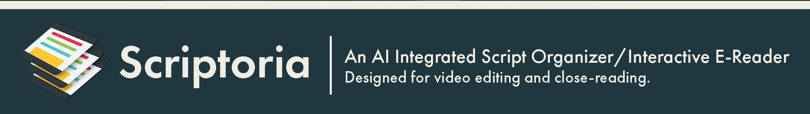

   

     
   

## Featuring a theme-based highlighting system, tagging, note-taking, and script creation with drag/drop Adobe Premiere Pro integration and built-in Gemini API.

Scriptoria is primarily designed to create a text-based workflow for video editors that involves using an LLM to structure video captions into an interactive HTML text transcript. The transcript can then be marked up and arranged into a script to aide with video outlining and narrative structuring via theme-based highlighting, tagging, and note taking. There is functionality that allows for your script to easily link back with captions in Adobe Premiere Pro, and a customized Gemini API assistant. There is also a robust filtering system to make it easy to find and locate specific highlights according to theme, tags, favorite, and used (whether it has been used yet in the video) status.

**What is theme-based highlighting?** Theme-based highlighting refers to the central workflow of Scriptoria, where the user can create theme names and assign them to specific highlight colors. You can then use these colors/themes to organize your transcript/book accordingly. You can then easily refer back to your highlights by their themes.

Secondarily it is also a versatile tool for reading and marking up any long-form document like books and articles. It features a streamlined import process for EPUB files and will automatically attempt to format any text you copy from the internet. Text is formatted via a simple syntax system that Scriptoria recognizes, with the ability for the user to manually format the text if automation techniques fail for a particular document. 

In addition to its video-production-tailored feature set, Scriptoria has also been designed so that the reader can utilize it as a scholarly aide to the text. The theme-based highlighting, tagging, and note-taking systems make for a robust interactive e-reader. Additionally, the Gemini API integration allows you to ask questions to Gemini about any selected text instantly without leaving the program.

**Currently, Scriptoria is Windows and desktop only**

  

## What video editing challenge it tackles

For video editors working with interviews, documentaries, or event footage, the process of finding the right soundbites ("paper editing") can be slow and cumbersome. It often involves scrubbing through hours of footage. NLE video editors are naturally designed to work with video as the principle element and as such the ability to structure narratives within the program is weighed down by a UI and UX that is suited for video. Not only that it is CPU and GPU intensive. Scriptoria circumvents that overhead and is designed to develop scripts and narrative in an intuitive text-based way. 

Scriptoria streamlines this by allowing you to work with the transcript as the central element, giving you a bird's-eye view of your content and enabling you to build a story structure efficiently. Theme-based highlighting, tagging, note-taking, drag/drop script creation, and AI chat integration help keep your thoughts and ideas organized and structured so you can build narratives efficiently and better. 

## Core workflow for video editors:

1.  **Process & Stylize Transcript:** Start with any text source. For video-editing, generate a caption text file in Adobe Premiere Pro (for example) and paste these captions into the Process Captions tab. Process it by using the program provided prompt in an LLM of your choosing or directly in software with the integrated **Gemini API** to automatically structure the captions into Scriptoria's accepted syntax formatting. You can also import text from **EPUBs** or from the internet, and Scriptoria will automatically format based on the embedded HTML or Markdown tags in the epub file or clipboard. Default prompts are provided, and a system is in place for you to write and store your own custom preset prompts.

2.  **Markup with Themes:** Instead of generic highlighting, you create custom **Themes** (e.g., "Emotional Moment," "Challenges," "Solutions"), each with a unique color and a keyboard hotkey (1-9, 0, -, +). As you read the transcript, select text and highlight segments by theme. You can also create tags, secondary themes, footnotes, set favorites, and mark segments as "used" if you've already used it in the video. A robust filtering system is designed to make it easy to find text according to these metadata categories.

3.  **Arrange in the Script Editor:** Every highlight you create becomes a movable block or **Annotation** in the **Theme Panel**. Here, you can drag and drop these blocks into the **Script Editor** to arrange your narrative. You can also **strikethrough** parts of text that you will cut out, mark segments as "used" by your edit, see estimated script length in minutes, and export the script as a PDF file to share.

4.  **Integrate with Premiere Pro:** Once your narrative is structured, **Alt+Drag** a text block from Scriptoria's Script Editor and drop it onto your Premiere Pro project window. This action simulates a search command, which locates and scrubs to in the timeline that exact text segment within your Premiere sequence, ready for you to splice into your timeline.

## As an e-reader...

Scriptoria's feature set makes it a capable tool for anyone working with long-form text:

*    Import EPUBs directly into the program or copy and paste text from the internet.
*    Organize your reading/studying with theme-based highlighting, tagging, and notes/commentary.
*    Use the integrated Gemini assistant to ask questions directly to the text, and save preset prompts for easy access. 

## Key Features

*   **Re-format captions to readable paragraph form** Utilize the embedded Gemini API or use the provided prompt to transform raw, timecoded caption files into clean, readable text formatted with Scriptoria's syntax. The tool includes default prompts optimized for interviews, and allows you to **create, save, and manage your own custom prompts** 
*   **Thematic Highlighting:** Create up to 12 distinct **Themes**, each with its own color and hotkey. Annotations can also be assigned **Secondary Themes** for more detailed categorization.
*   **Robust Tagging System:** Add searchable tags (e.g., `#Strong-Closing-Line`, `#key-moment`) to any highlight for precise organization.
*   **Preset System:** Save and load custom sets of Themes and Tags to maintain consistency across projects.
*   **Interactive HTML Export:** Export your final, stylized transcript as a self-contained interactive HTML file.
*   **Filtering:** Filter your entire transcript to show only relevant highlights according to theme, tags, favorites etc...
*   **Integrated Gemini Assistant:** Highlight any passage in the transcript viewer and ask questions directly via an embedded Gemini API interface. Or use it to completely assemble scripts for you.

## Installation & Setup

**Windows:**
Download the latest release from the [Releases](https://github.com/delisimedia/Scriptoria/releases) and run the installer.

**macOS and Linux:**
Not available

### Changelog for v3.X.X
[Changelog](https://github.com/delisimedia/Scriptoria/blob/main/CHANGELOG.md)

## Dependencies

This project utilizes the following open-source libraries:

*   **PyQt6**: GUI toolkit. Licensed under GPLv3.
    *   [PyQt6 Website](https://www.riverbankcomputing.com/software/pyqt/intro)
    *   License: `LICENSES/GPLv3.txt`

*   **pyaudio**: Python bindings for PortAudio. Licensed under MIT License.
    *   [PyAudio PyPI](https://pypi.org/project/PyAudio/)
    *   License: `LICENSES/MIT.txt`

*   **BeautifulSoup4 (bs4)**: HTML/XML parser. Licensed under MIT License.
    *   [BeautifulSoup4 PyPI](https://pypi.org/project/beautifulsoup4/)
    *   License: `LICENSES/MIT.txt`

*   **google-generativeai**: Google Generative AI Python SDK. Licensed under Apache 2.0 License.
    *   [google-generativeai PyPI](https://pypi.org/project/google-generativeai/)
    *   License: `LICENSES/APACHE2.0.txt`

*   **PyMuPDF (fitz)**: PDF and XPS document toolkit. Licensed under AGPLv3.0.
    *   [PyMuPDF Website](https://pymupdf.readthedocs.io/en/latest/)
    *   License: `LICENSES/AGPLv3.txt`

*   **pdfminer.six**: PDF parser and analyzer. Licensed under MIT License.
    *   [pdfminer.six PyPI](https://pypi.org/project/pdfminer.six/)
    *   License: `LICENSES/MIT.txt`

---
**Note on Licenses:**
This project is open-source and uses libraries under various open-source licenses. Please refer to the `LICENSES` directory for the full text of each license.
